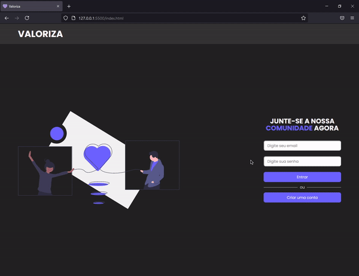

# Sobre o projeto

 

Esse é o front-end do [NLW Valoriza](https://github.com/henriquefontes/nlwvaloriza) criado como uma parte adicional da trilha de Node JS da Next Level Week 6.

**⚛️ Tecnologias Utilizadas:**

- [Javascript](https://developer.mozilla.org/pt-BR/docs/Web/JavaScript)

 

  

